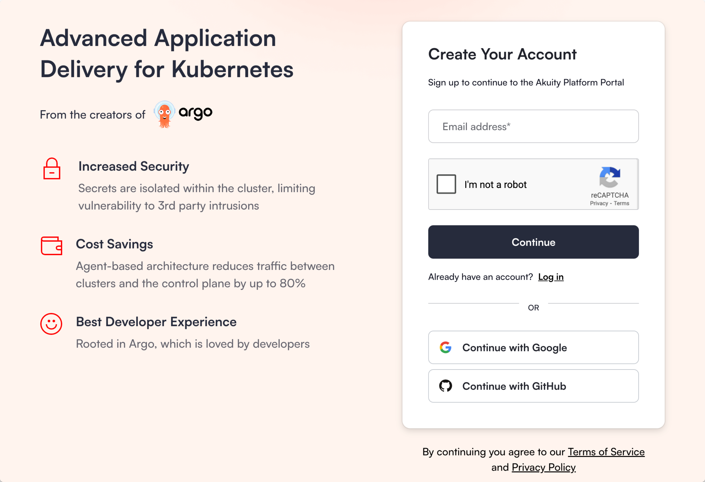
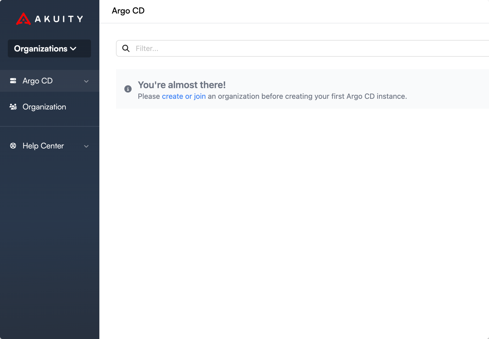
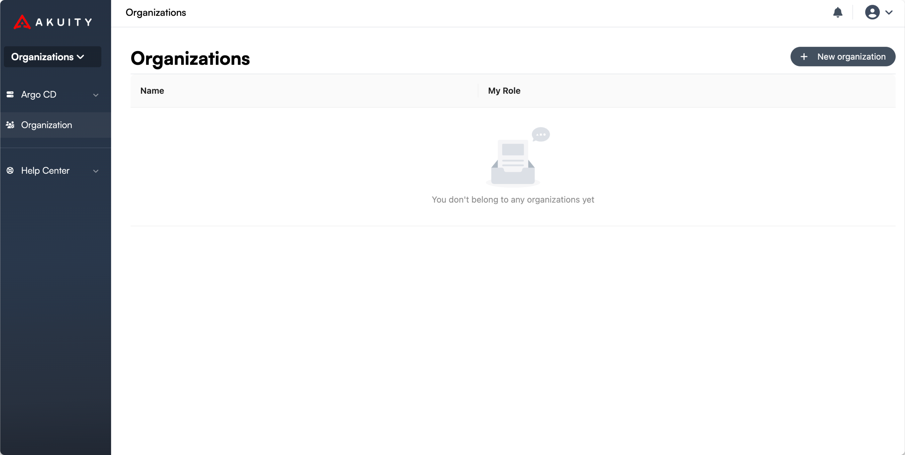
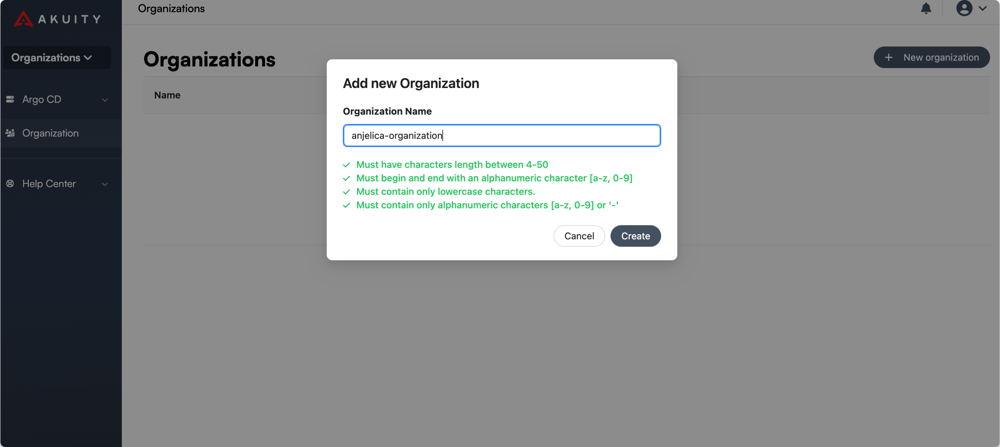

# How to Set Up Your Environment for the Workshop

# GitHub
A template is provided for this workshop. You have the option of using this template in **Codespaces**.

To use the <b>template</b>:

1. Click this [link](https://github.com/akuity/eks-workshop-template) to clone the repository to your GitHub.
Ensure the desired "Owner" is selected (e.g., your account and not an organization).
 
2. Enter ``akuity-eks-workshop`` for the repository name.
 
3. Click ``Create repository from template``.
 
4. *(Optional)* You can start a Codespace by clicking the green code button on the repo page, selecting the Codespaces tab, and then selecting ``Create codespace on main.``  
The codespace will open in another browser tab with information about setting up your Codespace. Once it's done setting up, you should see a terminal in the browser with the repo open.

{}
Unfamiliar with Codespaces? Check out the official documentation [here.](https://docs.github.com/en/codespaces/overview)
{}

# Akuity

1. You can create an Akuity Account [here](akuity.cloud).
    
2. You have 3 options to choose from, sign in with your **email**, **GitHub** or **Google Account**.
 

3. Once you've created an account, you'll receive a prompt to create an [organization](https://akuity.io/blog/introducing-akuity-workspaces). Click on the **Organization** tab to get started.
 

4. On the organizations page, go ahead and click **New Organization** in the top right corner.
 

5. Enter a name for your organization, and click **Create**. 
 

:tada: Congratulations, your **Akuity Account** is ready to deploy, promote, and monitor your EKS cluster.

In the next module, we'll discuss how to set up your **Argo CD Instance** within the Akuity Platform.