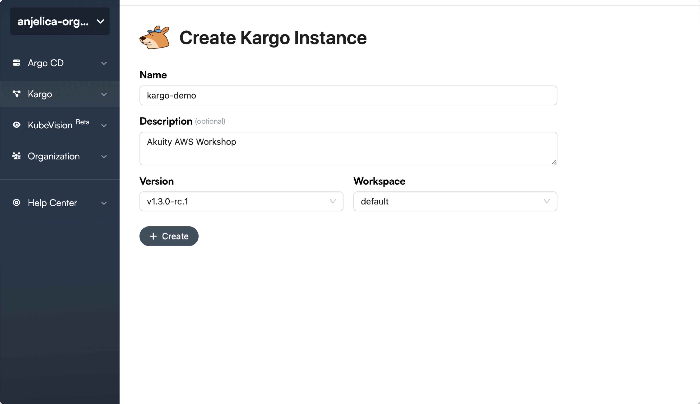
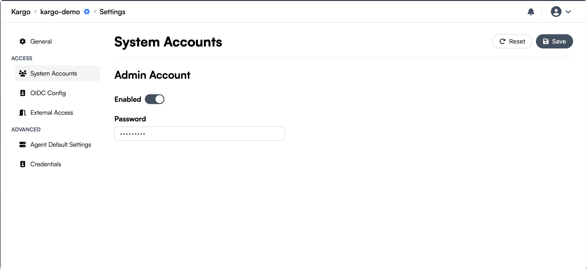
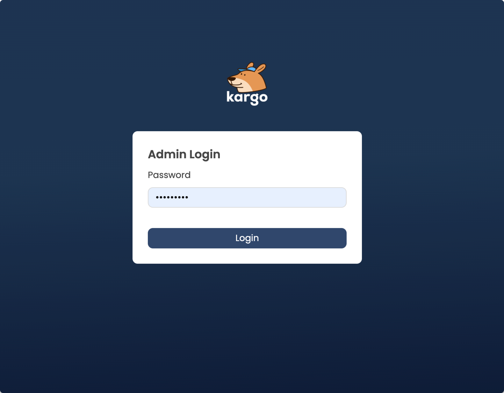

## Set Up Your Kargo Instance
1. Let's head on over to the Akuity Platform and click the **Kargo** tab under the Argo CD tab.
<br>

2. On the top right, click **+ Create**
<br>

3. Go ahead and name your Kargo Instance ```kargo-demo``` and add a description if you'd like. Click **CREATE** when you're satisfied.
<br>

<br>


4. You'll need to connect a Kargo Agent next. Go ahead and do so by clicking that **Register an Agent** button on the right.
<br>


5. Set the agent name, add a description, and then click the dropdown menu for **Akuity Managed Argo CD** and connect your Argo CD instance you created earlier.
<br>


<br>

6. Click **Connect** once you're done.
<br>

7. Just like Argo CD, we'll need to set up an admin account. Click **Settings**, and go into **System Accounts**.
<br>

8. Enable admin accounts by hitting the switch, then set a password. Hit **Save** on the top right. The cogwheel next to your Kargo Instance's name will start spinning.
<br>




<br>

{}
Put a pin in this!: keep your password handy, we'll need it to access the Kargo UI.
{}

1. Log in to Kargo CLI in your terminal with this command:
   
   
   ```shell
   
   kargo login https://localhost:31444 \
  --admin \
  --password admin \
  --insecure-skip-tls-verify

  ```

<br>


<br>

:tada: You are now able to access the Kargo UI.

