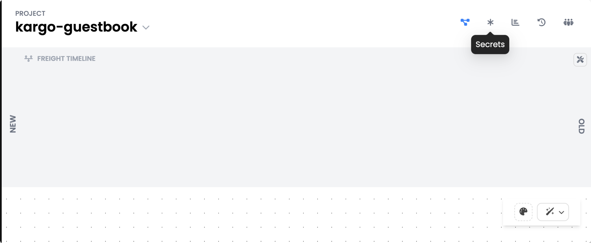
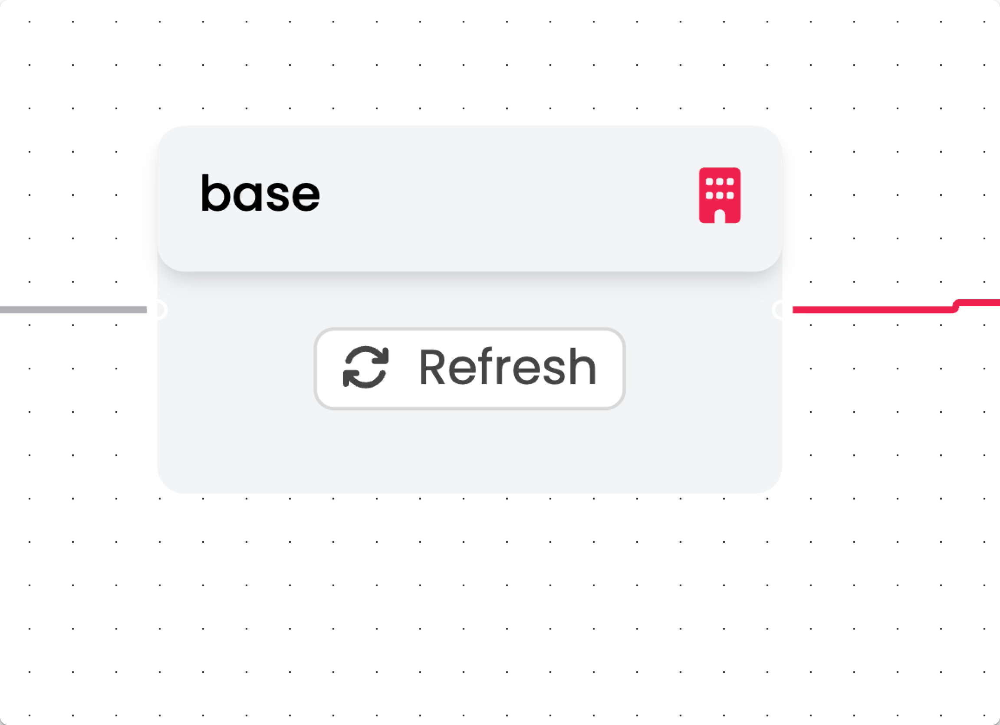

## Setting Up Your Kargo Project, Warehouse, and Stages


## Creating a Project
A **project** is a collection of related Kargo resources that describes one or more delivery pipelines. It is Kargo's basic unit of organization and tenancy. <br>
We can create our Kargo Project from the Kargo CLI. We have the YAML files already set up for you. You just need to apply the files.
<br>
1. Run this command in your terminal: 
``` 
kargo create project kargo-guestbook
```
<br>
If you move over to your Kargo UI, a new project will show up, but it will be blank.


## Set Your GitHub Credentials
Next, you'll have to set up a secret for your Kargo Project. This is so Kargo has access to your GitHub repository and can make commits. 
1. Go back to your terminal and enter this command, make sure you fill the blanks with the appropiate information.
<br>
```shell
kargo create credentials github-credentials \
--project kargo-guestbook --git \
--username <your username> --password <your GITHUB PAT> \
--repo-url https://github.com/<your repo>
```
<br>
2. You should receive an output like this: <br>

```shell

secret/github-credentials created
```
:tada: Your GitHub credentials have been saved! You can view your secrets on the top right corner in your Kargo Project's UI. It is marked with an asterisk (*).
<br>



<br>

## Apply Your Project
Now that Kargo has access to your repository, we can start applying the manifests in the template. If you navigate to **Kargo** folder on your repo, you'll see the **project.yaml**:
```yaml
apiVersion: kargo.akuity.io/v1alpha1
kind: Project
metadata:
  name: kargo-guestbook
  annotations:
    # This annotation ensures Projects (Namespaces) are created first when deployed via Argo CD
    argocd.argoproj.io/sync-wave: "-1"


```
<br>
We'll need to apply this manifest to our Kargo project. <br>

1. In your terminal, run this command:<br>
   ```shell
    kargo apply -f ./kargo/project.yaml
   ```
<br>

## Creating a Warehouse
Next step, we need to create a **Warehouse**. A **Warehouse** is a source of **Freight**. <br> 
Freight is a set of references to one or more versioned **artifacts** (resources that you update as part of your deployment/delivery pipelines).
If you take a look in the **Kargo** folder of your template, you'll see the ```warehouse.yaml```:
<br>
```yaml
apiVersion: kargo.akuity.io/v1alpha1
kind: Warehouse
metadata:
  name: base
  namespace: kargo-guestbook
spec:
  subscriptions:
  - git:
      branch: main
      commitSelectionStrategy: NewestFromBranch
      discoveryLimit: 20
      repoURL: https://github.com/<repo-name>
      includePaths:
      - base/values.yaml
```

<br>

Time to apply this manifest to our ```project```. 
<br>
1. Just like we did with the ```project.yaml```, use this command to apply the manifest:<br>
```yaml
kargo apply -f ./kargo/warehouse.yaml
```
<br>

Now, if you look at the Kargo UI, you should have a warehouse called "base" ready.


<br>

## Kargo Stages Explained
Stages are arguably Kargo's most important concept. Think of stages as [environments](https://akuity.io/blog/kargo-stage-not-environment). These stages can represent the stages in an application's lifecycle. For example:
- Development ("dev")
- Staging ("stg")
- Production ("prd")
<br>

If you go back to your repo and look at your **Kargo** folder, you'll find the ```stages.yaml```. 
Here, we declare our [promotion steps](https://docs.kargo.io/user-guide/reference-docs/promotion-steps/). These are the steps that Kargo runs through whenever there is a promotion made. <br>
In this example, we run **5 Steps** to promote:
1. **git-clone**: We will clone the GitHub repository.
2. **copy**: We'll copy the values from the ```base/values.yaml``` and apply them into our ```guestbook/values-dev.yaml```.
3. **git-commit**: Kargo will commit the changes on our GitHub Repository.
4. **git-push**: Kargo will push these changes to the repository.
5. **argocd-update**: Finally, we will update our changes to Argo CD.

## Apply Your Stages
1. We need this manifest to reflect on the Kargo UI. Just like with the ```project``` and the ```warehouse```, we'll run this command:
```shell
kargo apply -f ./kargo/stages.yaml
```


