## Explorer Dashboard 
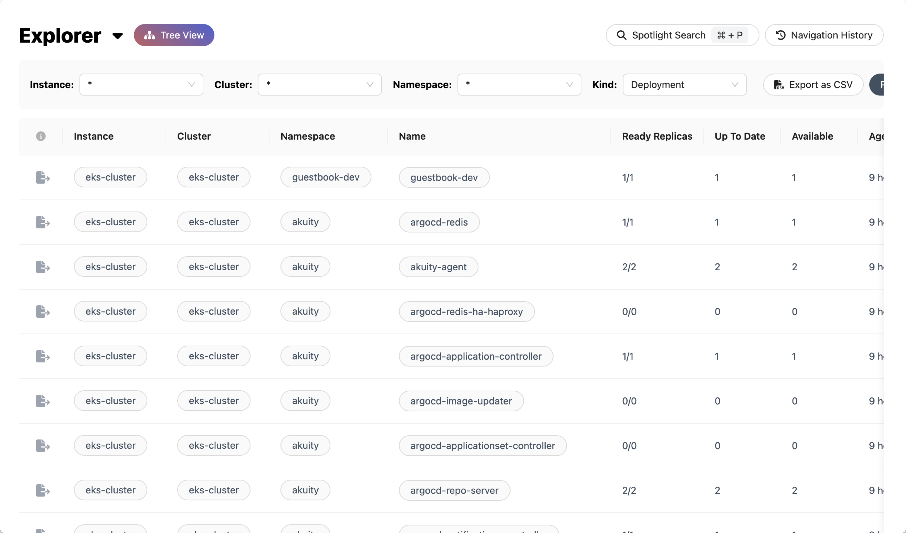
The Explorer Dashboard allows users to browse through cluster resources. Users can customize and tailor the Explorer Dashboard to suit their needs by using the drop boxes above.

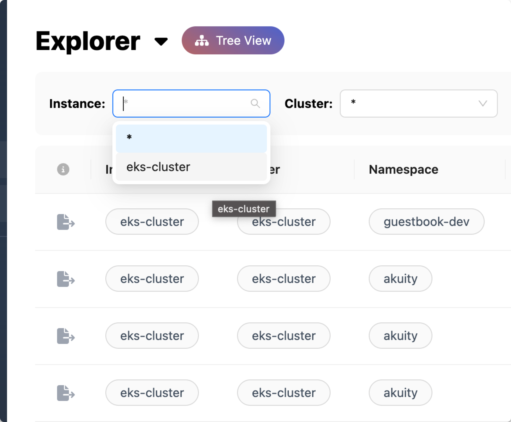

 

## Deprecated APIs Dashboard 
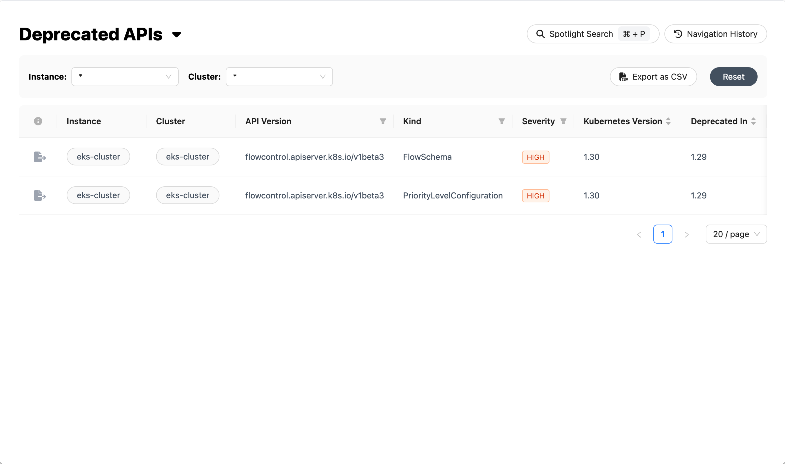
Sometimes, deprecated APIs can cause trouble in an application. The Deprecated APIs Dashboard helps you stay on top of obsolete APIs, by giving you suggestions of what version you can migrate/update to instead.

## Stuck in Deletion Dashboard
As the name suggests, this dashboard is for resources that are stuck in deletion. Resources displayed here have been stuck in the deletion state for more than 1 hour, as indicated by their deletion timestamps set over 1 hour ago.

## Container Dashboard
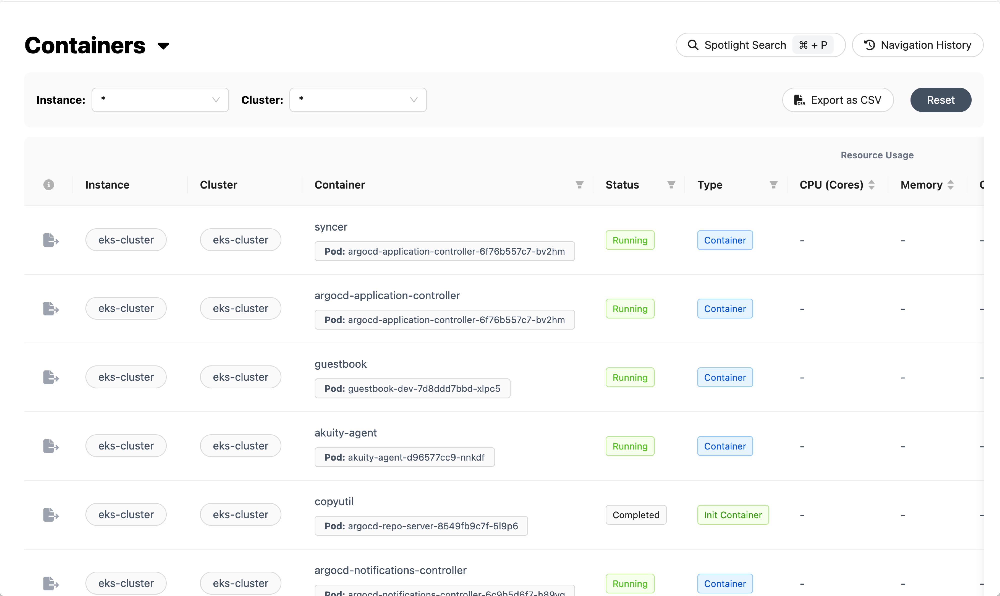
You can view your containers on the Container Dashboard. You can filter the Container Dashboard by clicking on the boxes. You can filter by Resource Usage, Resource Limits, and Resource requests. You can see how much memory and CPU a container uses at a glance.

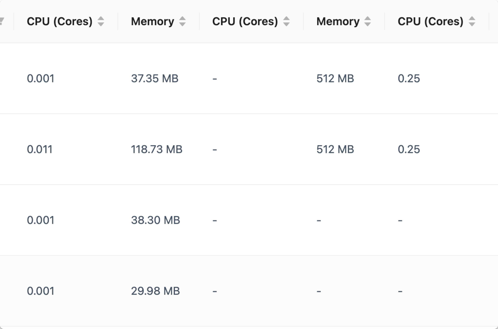

By clicking the arrows next to **Memory**, you can even filter by most memory used and least. This is great for those who wish to be mindful of how much CPU and RAM a cluster is using.

## Image Dashboard

This is where your images information is stored. You can filter by:

- Image Name

- The amount of containers

- Image Tags: These let you identify different versions of the same series of images

- Digest (if applicable): consists of a hash algorithm (such as sha256) and a hash value.

- CVEs (Common Vulnerabilities and Exposures): publicly accessible databases that catalog known software and hardware security flaws. Ensure CVE scanning is enabled in KubeVision and only public images are scanned.

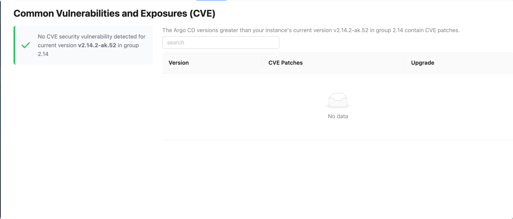

You can also find your CVEs in the **Security** tab of your Argo CD Instance.

## Infrastructure
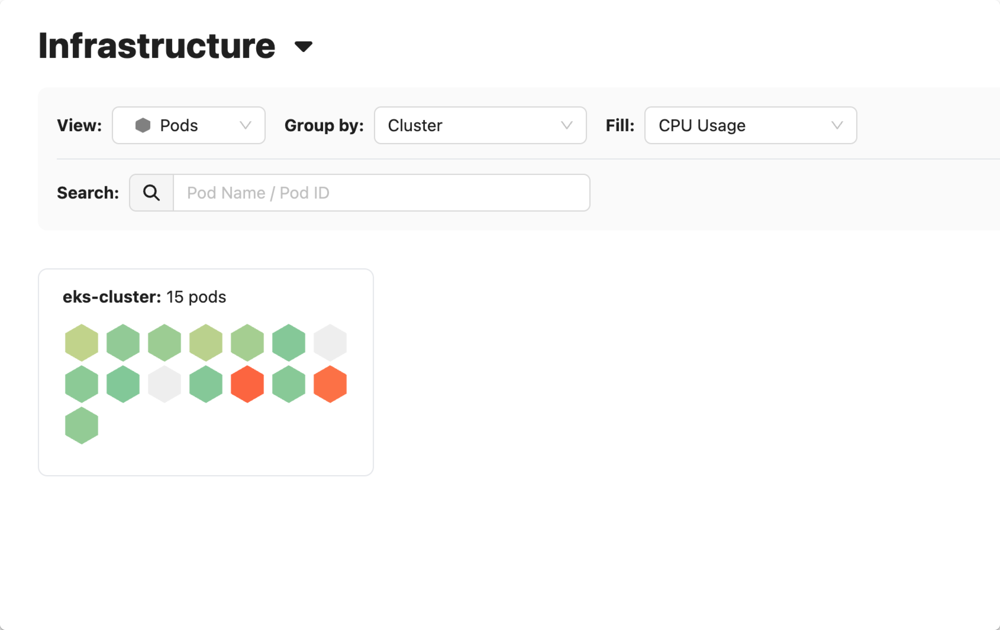
The infrastructure dashboard offers two different perspectives: **Pods** and **Nodes**. 

In **Pods** view, you can group by:
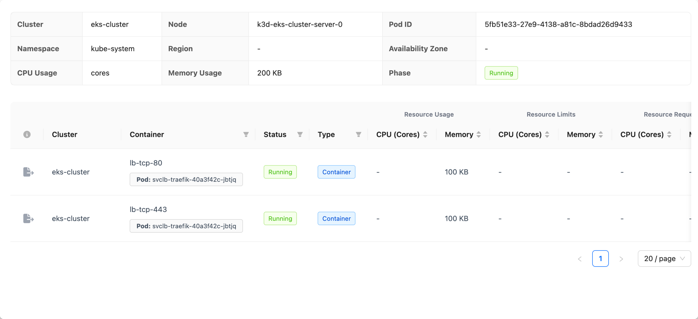

- Cluster

- Availability Zone: a part of a cloud computing infrastructure that's designed to protect data and applications from data center failures

- Region

- Node

In **Nodes** view, you can group by:

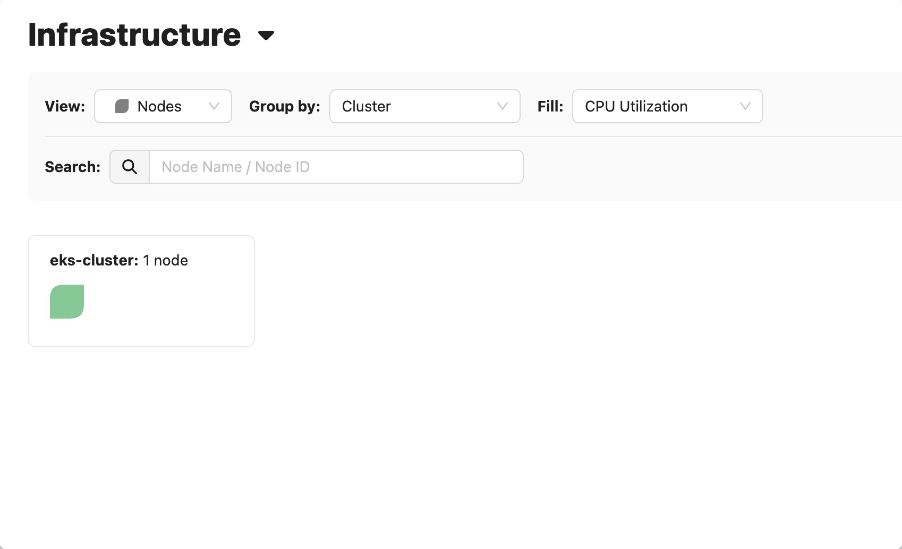

- CPU Utilization

- Memory Utilization

- Pod Count

- Pod Utilization

## Timeline View
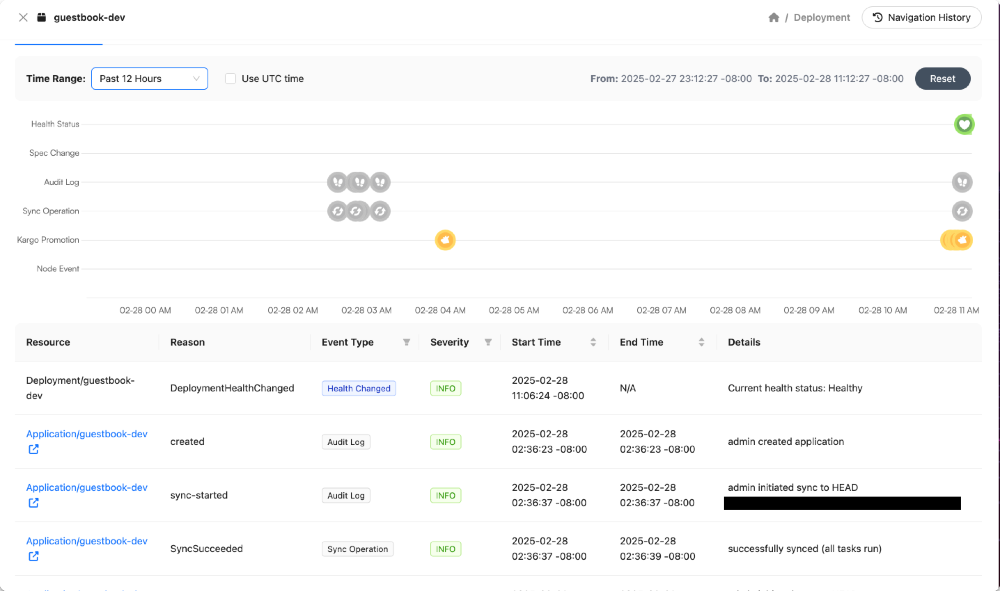
KubeVision’s Timeline view captures errors in real-time. You can set the time period you would like to see events from. The Akuity Platform stores and displays information on critical workload events, which can be a clutch for troubleshooting deployment failures, promotion failures, cluster health changes, etc. If you take a look at the image above, there are **yellow circles** with Kargo's head in the center. That signifies an issue with Kargo.

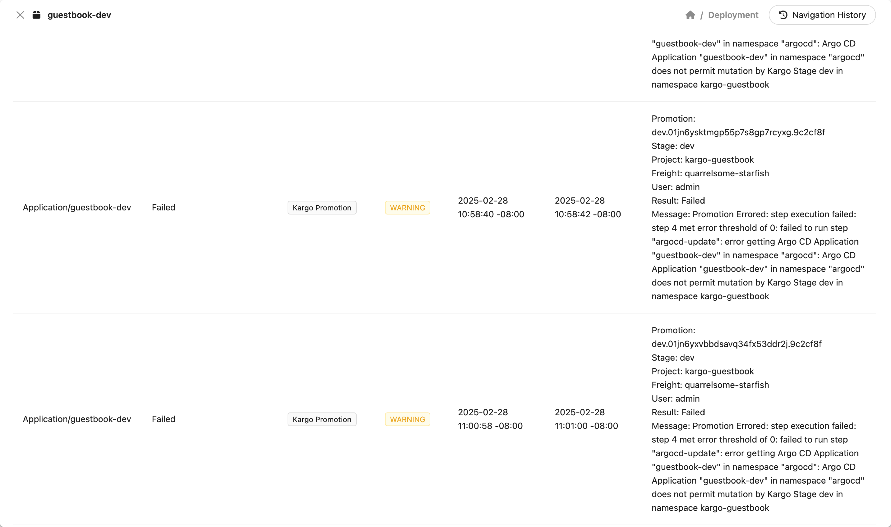
If we scroll down to the log, we can see details about an error (in this case, a promotion failure). All the information is kept on the right, and the times and dates that the error occurred is on the left. 

## Enable the AI Assistant
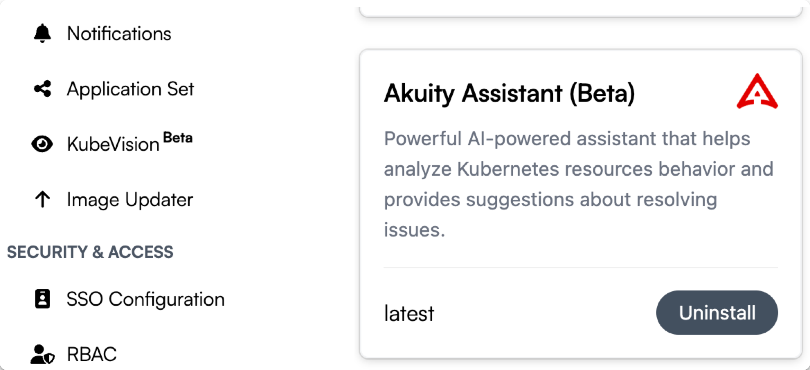
There is an extension available that allows an AI-powered assistant analyze your Kubernetes resources behavior and can provide insights and suggestions. Here's how to enable the AI assistant:
1. Go to Your **Argo CD Instance**.
 

2. Click the cogwheel on the top right for **Settings**.

 

3. Under **General** is **Extensions**:
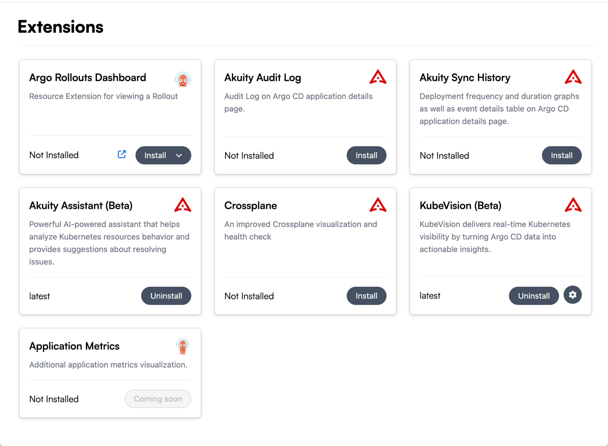

4. Find **Akuity Assistant**, and click **Install**.
 

5. Your Akuity Assistant is ready! Go ahead and go to the **Explorer** dashboard and click on any instance. A new tab, **Assistant** will show up. You can ask the assistant to analyze deployment logs, review deployment issues, etc.

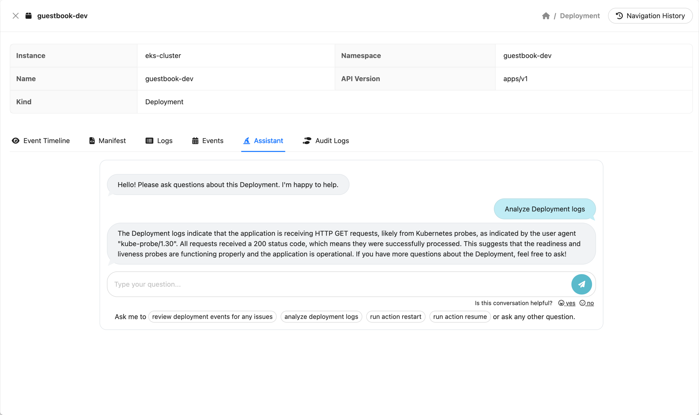

 

:tada: Congratulations! You have completed the workshop. Let's review what we learned today. :arrow_right:
